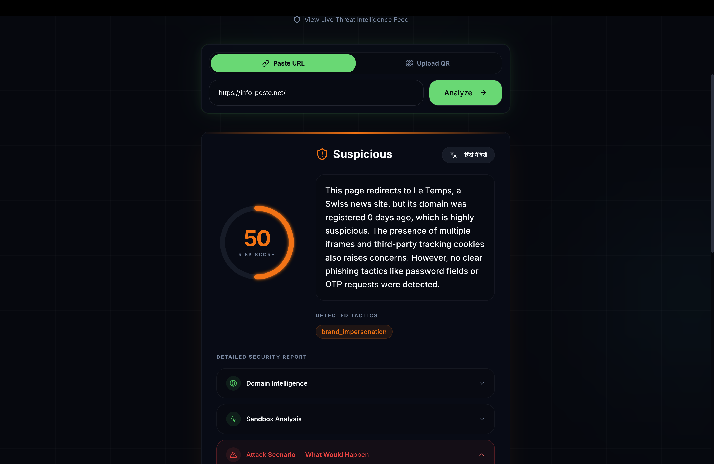
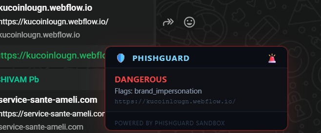
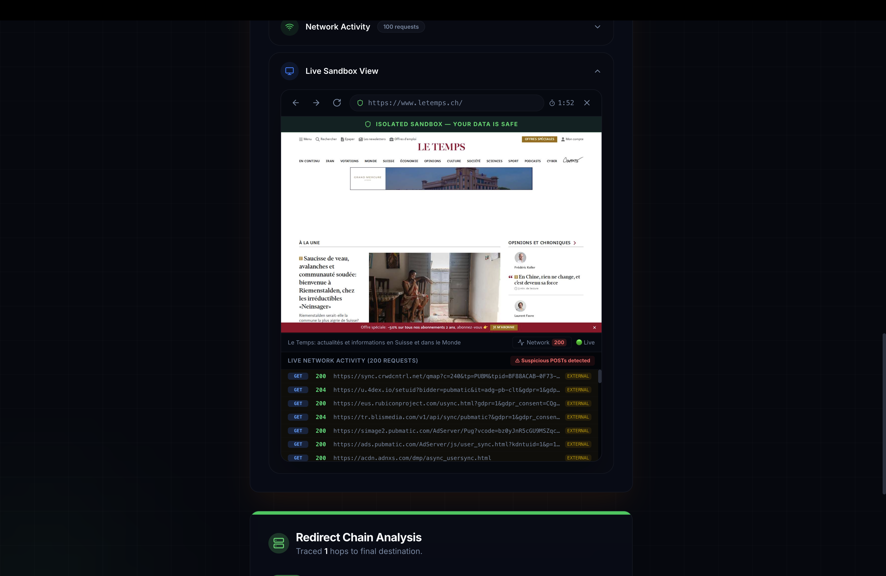
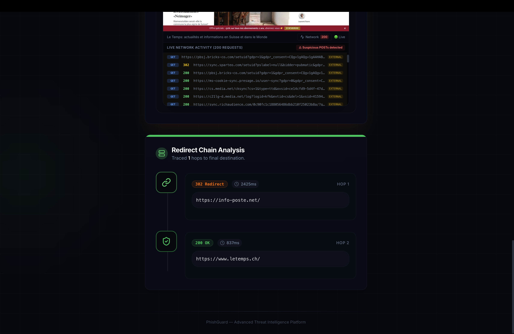
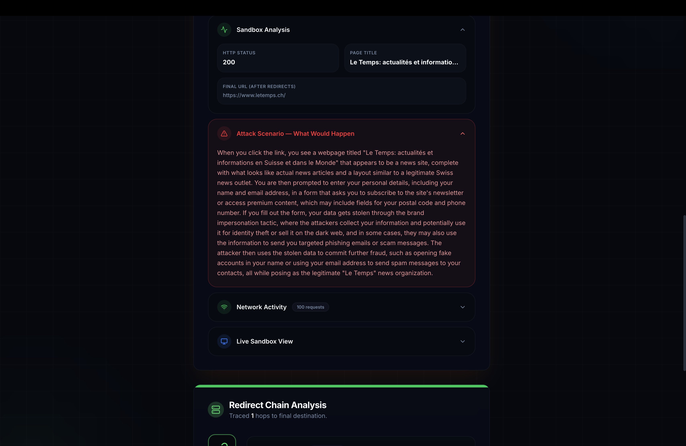

# 🛡️ PhishGuard

**Real-time phishing & scam URL detection platform built for Indian digital fraud.**

PhishGuard analyzes URLs and QR codes through **five independent security engines** running in parallel — domain intelligence, NLP text analysis, browser sandbox, redirect chain tracing, and LLM reasoning — fusing their signals into a single risk score with bilingual verdicts (English + Hindi).

> Unlike blocklist-based tools (Google Safe Browsing), PhishGuard detects **zero-day phishing sites** that have never been reported before.

---

## ✨ Key Features

| Feature | Description |
|---------|-------------|
| **5-Engine Analysis** | Domain heuristics, NLP, visual sandbox, redirect tracing, and LLM reasoning run in parallel |
| **Live Interactive Sandbox** | Browse suspicious sites safely inside an isolated Docker container — zero risk to the user |
| **QR Code Scanning** | Upload a QR code image → URL extracted via OpenCV → fed through the full analysis pipeline |
| **Bilingual Verdicts** | LLM generates human-readable attack scenarios in English and Hindi |
| **India-Focused Detection** | Tuned for SBI, IRCTC, UPI, Aadhaar, EPFO, Paytm, and Hindi-language scam patterns |
| **Real-Time Network Monitoring** | Live network activity log inside the sandbox highlights suspicious external POSTs |
| **Chrome Extension** | Trigger analysis on any URL directly from the browser toolbar |
| **Threat Feed + Telegram Alerts** | Confirmed phishing URLs are added to a shared feed with optional Telegram notifications |

---
## Screenshots






## 🏗️ Architecture

```
User (React Frontend)
        │  URL / QR code
        ▼
   FastAPI Backend
        │
   ┌────┴────────────────────────────────────────┐
   │  5 Parallel Analysis Engines                 │
   │                                              │
   │  1. Domain Service   (heuristic scoring)     │
   │  2. NLP Service      (text/keyword signals)  │
   │  3. Sandbox Service  (visual + DOM + MITM)   │
   │  4. Redirect Service (hop chain tracing)     │
   │  5. LLM Service      (Groq / LLaMA-3.3-70B) │
   └──────────────────────────────────────────────┘
        │  Fused composite score (0–100)
        ▼
   Redis Cache  ←→  SQLite/Postgres DB
        │
        ▼
   Threat Feed  +  Telegram Alert Bot
```

### Live Sandbox Data Flow

```
React Canvas ←── JPEG frames ←── CDP Screencast ←── Chromium (Playwright)
     │                                                     ▲
     │── click/scroll/type events ── WebSocket ──────────────┘
     │                                    ↕
     │                          FastAPI (proxy layer)
     │                                    ↕
     └───────────────────── Docker Container (ephemeral)
```

---

## 🔬 The Five Analysis Engines

### 1. Domain Analysis (`domain_service.py`)

| Check | Points | Description |
|-------|--------|-------------|
| Subdomain Spoofing | +50 | `google.com.evil.net` — brand in subdomain, different real domain |
| Typosquatting | +35 | Levenshtein distance ≤ 3 from known brand domains |
| Brand Keyword in Domain | +30 | `sbi-kyc-update.top` detected via word-boundary regex |
| Raw IP Address | +30 | URLs using `http://192.168.x.x` instead of domain names |
| Domain Age (<7 days) | +30 | WHOIS lookup flags freshly registered domains |
| Suspicious TLD | +20 | `.xyz`, `.top`, `.click`, `.loan`, `.tk`, etc. |
| VirusTotal | +25 | Async API check — flags if >2 engines report malicious |
| No HTTPS | +10 | Missing TLS certificate |

*Max contribution: **60 points** (capped)*

### 2. NLP Analysis (`nlp_service.py`)

| Check | Points | Description |
|-------|--------|-------------|
| Urgency Patterns | +8 each | `account.*suspended`, `kyc.*verify`, `prize.*reward` |
| Hindi Keywords | +10 | `खाता बंद`, `केवाईसी`, `इनाम`, `लॉटरी`, `तुरंत` |
| OTP/Credential Demands | +15 | `otp.*share`, `password.*give`, `cvv.*enter` |
| URL Shorteners | +10 | `bit.ly`, `tinyurl`, `cutt.ly`, etc. |
| Suspicious Mobile Numbers | +8 | Indian mobile numbers in banking context |

*Max contribution: **35 points** (capped)*

### 3. Sandbox Analysis (`sandbox_service.py` + `app.py`)

| Check | Points | Description |
|-------|--------|-------------|
| External POST Requests | +20 | Page sends data to unknown third-party servers |
| Form → External Domain | +20 | `<form action="https://evil.com">` |
| Credential Forms + Context | +15 | Password/OTP fields combined with other suspicious signals |
| Brand Impersonation in Title | +20 | Title says "SBI" but domain isn't `sbi.co.in` |
| MITM: Credential Exfiltration | +20 | Fake credentials detected in outgoing GET URLs |
| MITM: Hard Block | +30 | Proxy terminated the session due to malicious activity |

*Max contribution: **40 points** (capped)*

### 4. Redirect Chain (`redirect_service.py`)

| Check | Risk Level | Description |
|-------|-----------|-------------|
| TDS Parameters | Medium | `clickid=`, `aff_id=` in URL |
| Fast Flux Timing | Medium | Redirect hops resolving in <50ms |
| Meta-Refresh / JS Redirect | Medium | Non-HTTP redirect via `<meta http-equiv="refresh">` |
| Obfuscated URLs | High | Base64-encoded or long hex strings in URL |
| Protocol Downgrade | High | HTTPS → HTTP redirect |
| Open Redirect Abuse | High | Trusted domain (Google, Bing) used as redirect hop |

*Max contribution: **20 points** (capped)*

### 5. LLM Reasoning (`llm_service.py`)

- **Model**: LLaMA-3.3-70B via Groq API (~300ms response time)
- **Input**: Structured JSON from all 4 heuristic engines
- **Output**: Final score, tactic tags, bilingual verdict, attack scenario
- **Constraint**: LLM score is clamped to ±10 of the heuristic composite — it cannot override hard evidence

---

## 📊 Scoring Logic

```python
raw_score       = domain_score + nlp_score + sandbox_score + redirect_penalty
composite_score = min(raw_score, 100)
llm_score       = get_llm_score(all_context)
final_score     = clamp(llm_score, composite_score - 10, composite_score + 10)
```

| Score | Risk Level | Action |
|-------|-----------|--------|
| 0–39 | 🟢 **SAFE** | Safe to browse |
| 40–69 | 🟡 **SUSPICIOUS** | Proceed with caution |
| 70–100 | 🔴 **DANGEROUS** | Do not open |

---

## 🔒 Security Design

### Live Sandbox Isolation

Each live sandbox session runs in its own **ephemeral Docker container**:

- `--cap-drop=ALL --cap-add=SYS_ADMIN` — minimal Linux capabilities
- `--security-opt no-new-privileges` — prevents privilege escalation
- `-m=512m --cpus=1.0` — hard resource limits
- `read_only: true` — read-only filesystem
- `--rm` + `docker rm -f` — container destroyed on disconnect or 2-min timeout
- Non-root user (`sandboxuser`) inside the container
- User receives only **JPEG frames** — zero JavaScript from the target site reaches the user's browser

### MITM Proxy (Docker Mode)

When running in full Docker mode, a **mitmproxy** subprocess runs alongside Playwright inside the sandbox container:

- All Chromium traffic is routed through the proxy (`--proxy-server`)
- Fake credentials are injected into forms and submitted
- The proxy watches for those exact strings appearing in outgoing POST/GET requests
- If detected → **credential exfiltration confirmed** (+20 to +30 score)

---

## 🛠️ Tech Stack

| Layer | Technology |
|-------|------------|
| **Frontend** | React 18, TypeScript, Tailwind CSS, Framer Motion, shadcn/ui |
| **Backend** | FastAPI (Python 3.12), Uvicorn (ASGI) |
| **Browser Automation** | Playwright (async + sync API, Chromium CDP) |
| **LLM** | LLaMA-3.3-70B via Groq API |
| **QR Code** | OpenCV (`opencv-python-headless`) |
| **Caching** | Redis 7 (async) |
| **Database** | SQLite (dev) / PostgreSQL (prod) |
| **Containerization** | Docker, Docker Compose |
| **Networking** | WebSockets (FastAPI + `websockets` library) |
| **NLP** | Custom heuristic engine (`python-Levenshtein`, `tldextract`) |

---

## 🚀 Getting Started

### Prerequisites

- **Python 3.12+**
- **Node.js 18+** and **npm**
- **Docker** (for sandbox features)
- **Redis** (for caching)

### Environment Variables

Create a `.env` file in the project root:

```env
GROQ_API_KEY=your_groq_api_key
VIRUSTOTAL_API_KEY=your_vt_key          # optional
REDIS_URL=redis://localhost:6379        # default
SANDBOX_USE_DOCKER=0                    # set to 1 for Docker sandbox mode
```

### Local Development

```bash
# 1. Clone the repo
git clone https://github.com/DuttaNeel07/PhishGuard.git
cd PhishGuard

# 2. Backend setup
cd backend
python -m venv venv
source venv/bin/activate
pip install -r requirements.txt
playwright install chromium
uvicorn app.main:app --reload --port 8000

# 3. Frontend setup (new terminal)
cd frontend
npm install
npm run dev

# 4. Open http://localhost:5173
```

### Docker Deployment (Full Stack)

```bash
# Build and run everything
docker-compose up --build

# Or just the sandbox container
docker build -f Dockerfile.sandbox -t phishguard-sandbox .
```

### Live Sandbox (Docker Mode)

```bash
# 1. Build the sandbox image
docker build -f Dockerfile.sandbox -t phishguard-sandbox .

# 2. Set the environment variable
export SANDBOX_USE_DOCKER=1

# 3. Start the backend (it will auto-spawn containers per session)
uvicorn app.main:app --reload --port 8000
```

---

## 📁 Project Structure

```
PhishGuard/
├── backend/
│   ├── app/
│   │   ├── main.py                 # FastAPI application entry point
│   │   ├── config.py               # Settings and environment variables
│   │   ├── database.py             # Redis cache + SQLite/Postgres
│   │   ├── models/
│   │   │   └── schemas.py          # Pydantic models
│   │   ├── routes/
│   │   │   ├── analyze.py          # Main analysis endpoint
│   │   │   ├── sandbox_live.py     # Live sandbox WebSocket handler
│   │   │   ├── report.py           # Threat reporting
│   │   │   └── qr.py              # QR code upload endpoint
│   │   └── services/
│   │       ├── domain_service.py   # Engine 1: Domain heuristics
│   │       ├── nlp_service.py      # Engine 2: NLP text analysis
│   │       ├── sandbox_service.py  # Engine 3: Visual/DOM sandbox
│   │       ├── redirect_service.py # Engine 4: Redirect chain
│   │       └── llm_service.py      # Engine 5: LLM reasoning
│   ├── requirements.txt
│   └── Dockerfile
├── sandbox/
│   ├── app.py                      # Sandbox microservice (Docker mode)
│   ├── sandbox_ws_server.py        # Live sandbox WebSocket server
│   ├── mitm_addon.py               # mitmproxy addon for exfil detection
│   └── Dockerfile
├── frontend/
│   └── client/
│       └── src/
│           ├── pages/
│           │   └── Home.tsx        # Main analysis page
│           └── components/
│               ├── LiveSandbox.tsx  # Interactive sandbox viewer
│               └── RedirectChain.tsx# Redirect chain visualization
├── extension/                       # Chrome extension
├── Dockerfile.sandbox               # Standalone sandbox Docker image
├── docker-compose.yml               # Full production stack
├── docker-compose.sandbox.yml       # Sandbox-only compose
└── README.md
```

---

## 📡 API Endpoints

| Method | Endpoint | Description |
|--------|----------|-------------|
| `POST` | `/analyze` | Analyze a URL — returns risk score, flags, verdict |
| `POST` | `/qr/upload` | Upload QR code image → extract URL → analyze |
| `WS` | `/sandbox/live` | Live interactive sandbox session (WebSocket) |
| `GET` | `/threat-feed` | Get list of confirmed phishing URLs |
| `POST` | `/report` | Report a URL as phishing |

---

## 🤝 Contributing

1. Fork the repository
2. Create a feature branch (`git checkout -b feature/your-feature`)
3. Commit your changes (`git commit -m 'Add your feature'`)
4. Push to the branch (`git push origin feature/your-feature`)
5. Open a Pull Request

---

## 📄 License

This project is licensed under the MIT License.

---

<p align="center">
  Built with ❤️ for a safer  internet
</p>
